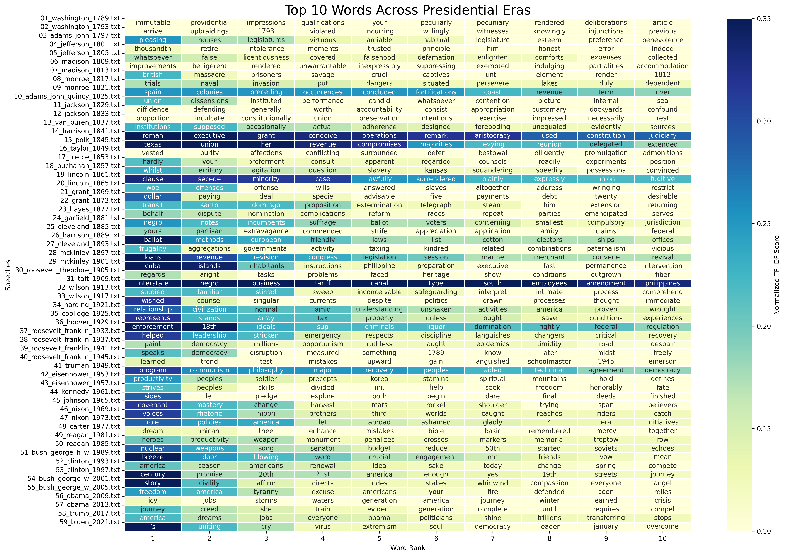

# Themes Across Time: Analyzing Presidential Speeches
This project uses the TF-IDF statistical measure to uncover hidden connections and similarities between American presidential speeches. Originally developed in Java, I’ve reworked it in Python to expand its capabilities, with plans to apply this analysis to notable French speeches as well. Through this comparative analysis, we explore how themes, priorities, and tones evolve across different eras and political landscapes.

## Structure
- `Main.java`: Java implementation of the similarity measurement.
- `python_discourse_analysis/`: Python implementation of the similarity measurement.

## Result

